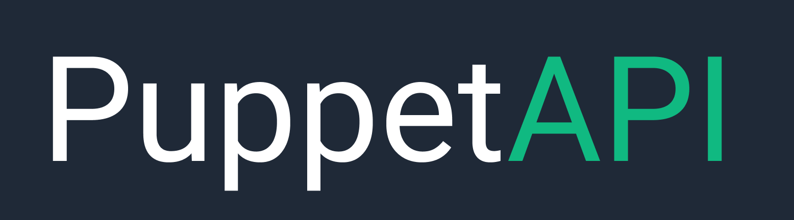

This project is for creating mock API and Real-Time testing.

### API Project (Back-end)
[MOCK-API](https://github.com/burkaydurdu/mock)

## Getting Started

### Project Overview

* Architecture:
[Single Page Application (SPA)](https://en.wikipedia.org/wiki/Single-page_application)
* Languages
  - Front end is [ClojureScript](https://clojurescript.org/) with ([re-frame](https://github.com/day8/re-frame))
* Dependencies
  - UI framework: [re-frame](https://github.com/day8/re-frame)
  ([docs](https://github.com/day8/re-frame/blob/master/docs/README.md),
  [FAQs](https://github.com/day8/re-frame/blob/master/docs/FAQs/README.md)) ->
  [Reagent](https://github.com/reagent-project/reagent) ->
  [React](https://github.com/facebook/react)
  - Client-side routing: [bidi](https://github.com/juxt/bidi) and [pushy](https://github.com/kibu-australia/pushy)
* Build tools
  - CLJS compilation, dependency management, REPL, & hot reload: [`shadow-cljs`](https://github.com/thheller/shadow-cljs)
  - Test framework: [cljs.test](https://clojurescript.org/tools/testing)
  - Test runner: [Karma](https://github.com/karma-runner/karma)
* Development tools
  - Debugging: [CLJS DevTools](https://github.com/binaryage/cljs-devtools),
  [`re-frame-10x`](https://github.com/day8/re-frame-10x),
  - Linter: [clj-kondo](https://github.com/borkdude/clj-kondo)


### Editor/IDE

Use your preferred editor or IDE that supports Clojure/ClojureScript development. See
[Clojure tools](https://clojure.org/community/resources#_clojure_tools) for some popular options.

### Environment Setup

1. Install [JDK 8 or later](https://openjdk.java.net/install/) (Java Development Kit)
2. Install [Node.js](https://nodejs.org/) (JavaScript runtime environment) which should include
   [NPM](https://docs.npmjs.com/cli/npm) or if your Node.js installation does not include NPM also install it.
3. Install [Chrome](https://www.google.com/chrome/) or
[Chromium](https://www.chromium.org/getting-involved/download-chromium) version 59 or later
(headless test environment)
    * For Chromium, set the `CHROME_BIN` environment variable in your shell to the command that
    launches Chromium. For example, in Ubuntu, add the following line to your `.bashrc`:
        ```bash
        export CHROME_BIN=chromium-browser
       ```
4. Install [clj-kondo](https://github.com/borkdude/clj-kondo/blob/master/doc/install.md) (linter)
5. Clone this repo and open a terminal in the `mock-ui` project root directory
6. (Optional) Setup [lint cache](https://github.com/borkdude/clj-kondo#project-setup):
    ```sh
    clj-kondo --lint "$(npx shadow-cljs classpath)"
    ```
7. Setup

[linting in your editor](https://github.com/borkdude/clj-kondo/blob/master/doc/editor-integration.md)

## Development

### Running the App

Start a temporary local web server, build the app with the `dev` profile, and serve the app,
browser test runner and karma test runner with hot reload:

```sh
npm install
```

```sh
npx shadow-cljs watch app
```
or
```sh
npm run watch
```

Please be patient; it may take over 20 seconds to see any output, and over 40 seconds to complete.

When `[:app] Build completed` appears in the output, browse to
[http://localhost:8280/](http://localhost:8280/).

#### Connecting to the browser REPL from your editor

See
[Shadow CLJS User's Guide: Editor Integration](https://shadow-cljs.github.io/docs/UsersGuide.html#_editor_integration).
Note that `npm run watch` runs `npx shadow-cljs watch` for you, and that this project's running build ids is
`app`, `browser-test`, `karma-test`, or the keywords `:app`, `:browser-test`, `:karma-test` in a Clojure context.

Alternatively, search the web for info on connecting to a `shadow-cljs` ClojureScript browser REPL
from your editor and configuration.

For example, in Vim / Neovim with `fireplace.vim`
1. Open a `.cljs` file in the project to activate `fireplace.vim`
2. In normal mode, execute the `Piggieback` command with this project's running build id, `:app`:
    ```vim
    :Piggieback :app
    ```

#### Connecting to the browser REPL from a terminal

1. Connect to the `shadow-cljs` nREPL:
    ```sh
    lein repl :connect localhost:8777
    ```
    The REPL prompt, `shadow.user=>`, indicates that is a Clojure REPL, not ClojureScript.

2. In the REPL, switch the session to this project's running build id, `:app`:
    ```clj
    (shadow.cljs.devtools.api/nrepl-select :app)
    ```
    The REPL prompt changes to `cljs.user=>`, indicating that this is now a ClojureScript REPL.
3. See [`user.cljs`](dev/cljs/user.cljs) for symbols that are immediately accessible in the REPL
without needing to `require`.

### Running Tests

Build the app with the `prod` profile, start a temporary local web server, launch headless
Chrome/Chromium, run tests, and stop the web server:

```sh
npm install
npm run ci
```

Please be patient; it may take over 15 seconds to see any output, and over 25 seconds to complete.

Or, for auto-reload:
```sh
npm install
npm run watch
```

Then in another terminal:
```sh
karma start
```

## Production

Build the app with the `prod` profile:

```sh
npm install
npm run release
```

## Dockerize

```sh
docker-compose build
```

```sh
docker-compose up -d
```
